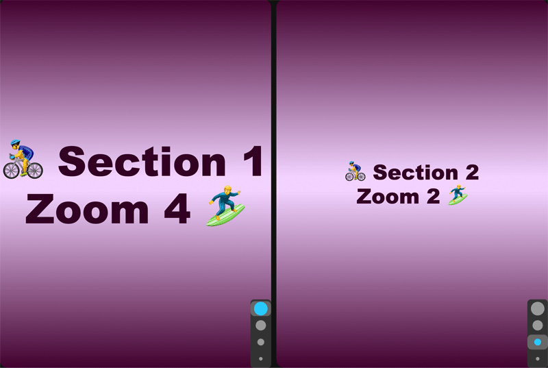

These "Hello World" examples are super short programs, great for learning Beads.

Hello1 draws a gradient and then one line of text

  

Hello3 draws two windows, and whichever side of the screen you are inside, if you roll the mouse wheel (which is considered the  z axis of the mouse), it will adjust the zoom level up or down one level as you go each step forward in the mouse. 
