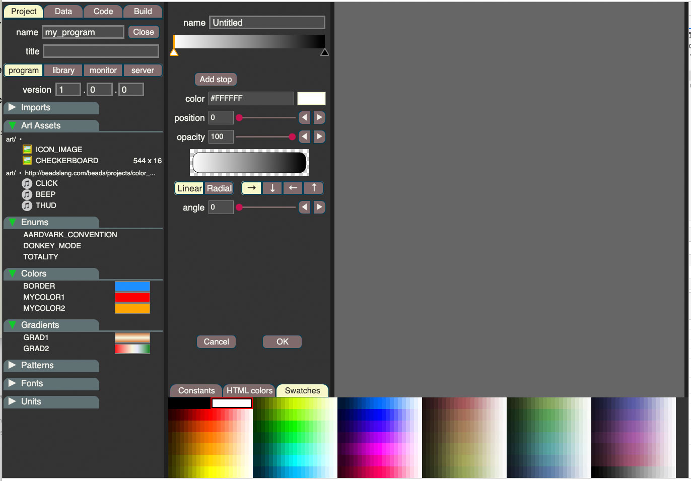

## The Builder program

These big example program is the start of the IDE for Beads. As a very long program, it shows lots of advanced features such as pointers to good effect.

### Section 1: Project panel

In the project panel you enter the program name, the version number, title, and then specify the project-wide declarations that will be used throughout the program:

- imported modules that you are going to bring in 
- art assets (sound, images, movies, etc.)
- enum constants (called symbols in JS)
- colors
- gradients
- regular expression patterns
- fonts
- custom units of measure 

### Section 2: Data panel

The Data panel allows you to define constants, variables, and record types.  Basically you are entering your database schema in this panel.

### Section 3: Code panel

The Code panel is where you add chunks of code to the system. The special reserved name **main_init** is a chunk that is execute once at the start of your program's execution. Then the **main_draw** function is used to draw the entire screen.

### Section 4: Build panel

In the Build panel you can see the generated code, and run the compilre to convert the generated Beads code into your output target, which is often going to be HTML/JS.